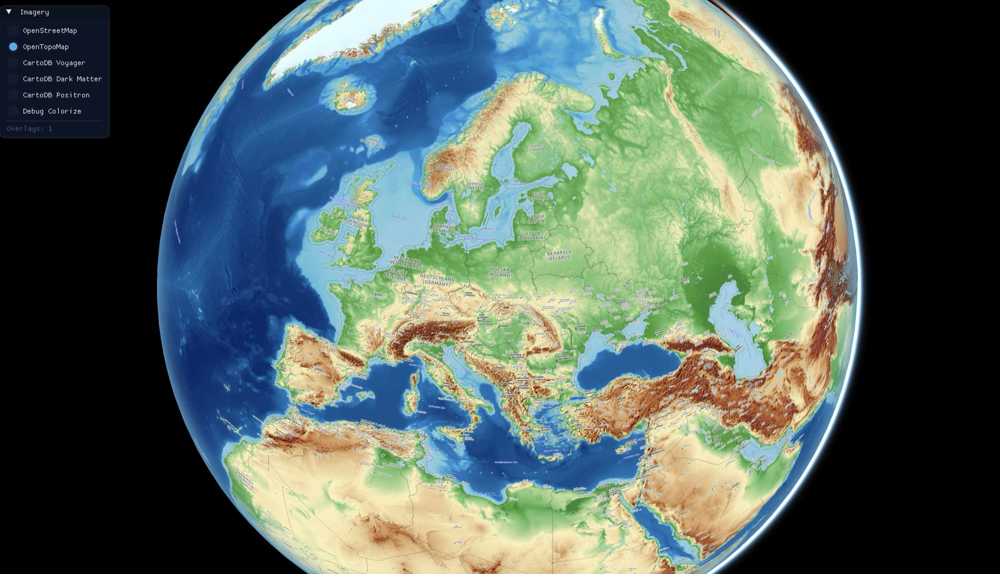
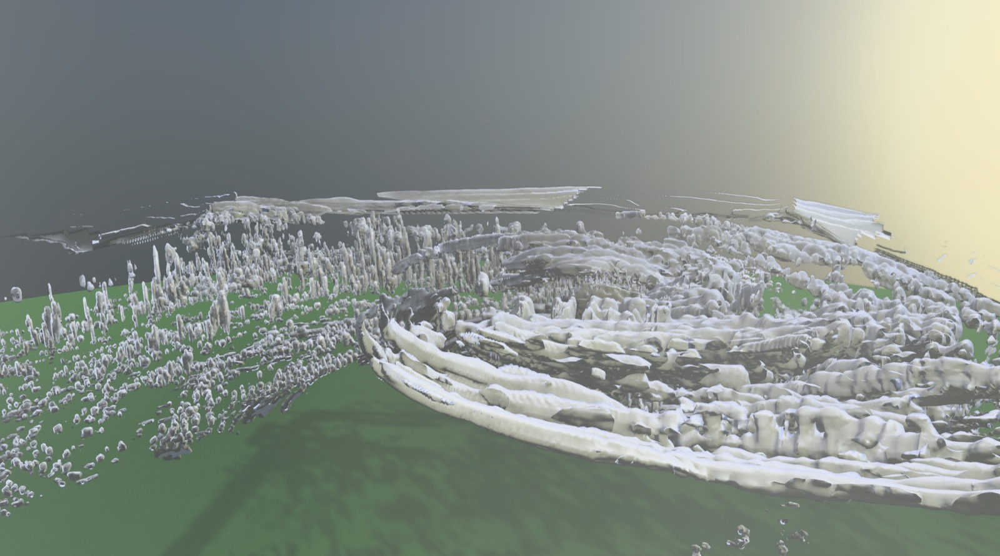
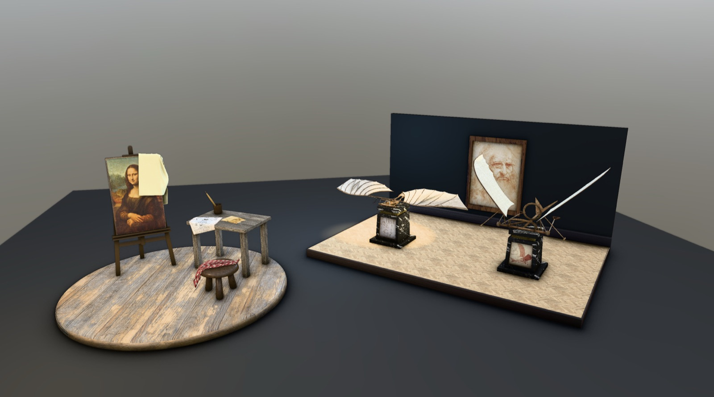

<p align="center">
  
</p>

# VisuTwin Canvas

[](LICENSE)
[](https://en.cppreference.com/w/cpp/23)
[](FEATURES.md)
[](https://canvas.visutwin.com)

A C++23 real-time rendering engine for **digital twins, geospatial scenes, and
scientific visualization** — running natively on Apple Metal and Vulkan 1.3.
Its architecture is derived from the [PlayCanvas](https://playcanvas.com/)
engine, rebuilt in C++ for native applications that need a physically based
renderer they can embed.

> **Status: Alpha.** The engine renders the scenes shown here and ships 44
> working examples, but the API is not stable and changes without notice.
> [FEATURES.md](FEATURES.md) lists what is implemented, module by module, along
> with the known gaps.

## Why this exists

Most engines that render a planet do it in a browser, and most engines that
render a scientific volume are not real-time. VisuTwin Canvas is aimed at the
overlap:

- **Native and embeddable** — a C++ library you link into an application, not a
  runtime you ship a project into or a browser you render inside.
- **Physically based, without a game engine attached** — modern PBR, shadows,
  and post-processing without an editor, a scripting VM, or an asset pipeline.
- **Built for instrumented scenes** — an ImGui/ImPlot overlay, 3D-anchored
  labels, and immediate-mode debug rendering are first-class, because digital
  twins are mostly data drawn on top of geometry.
- **Two backends, one feature contract** — Metal and Vulkan resolve the same 51
  shader features, so a scene behaves the same on either.
- **Readable by design** — an established engine architecture ported
  deliberately, with deviations from upstream documented in the code.

## Gallery

| | |
|---|---|
|  | **Volumetric scientific visualization.** Marching-cubes isosurfaces of the Hurricane Isabel dataset (IEEE Visualization 2004 contest data). Built with [`visutwin-viz`](https://github.com/visutwin). |
|  | **Physically based rendering.** Image-based lighting, soft shadows, and screen-space ambient occlusion — the `ambient-occlusion-davinci` example. |

The globe above is rendered with [`visutwin-geo`](https://github.com/visutwin)
(WGS84 ellipsoid, 3D Tiles, terrain tiling, atmosphere) on top of this engine.
Imagery © [OpenStreetMap](https://www.openstreetmap.org/copyright) contributors
and [OpenTopoMap](https://opentopomap.org/) (CC-BY-SA).

## Getting started

Runs on macOS (Apple Silicon and Intel) via Metal or Vulkan, and on Linux and
Windows via Vulkan 1.3. Requires CMake 3.28+, a C++23 compiler (Clang 16+ /
Apple Clang 15+), [vcpkg](https://vcpkg.io/), and Ninja.

```bash
export VCPKG_ROOT=/path/to/vcpkg

cmake --preset default
cmake --build build
```

Presets are `default` (Debug), `release`, `examples`, and `vulkan`. On macOS
`default` selects Metal and `vulkan` selects Vulkan; either can be forced with
`VISUTWIN_BACKEND_METAL=ON|OFF` and `VISUTWIN_BACKEND_VULKAN=ON|OFF`.

The 44 examples are opt-in:

```bash
cmake --preset examples
cmake --build build-examples
open build-examples/examples/visutwin-taa.app
```

Any application built on the engine honours `VISUTWIN_BACKEND` (`metal` or
`vulkan`), `VISUTWIN_SCREENSHOT` (write a PNG of the backbuffer), and
`VISUTWIN_SCREENSHOT_FRAME` — so an example can be switched or captured without
recompiling.

## Docs

- [FEATURES.md](FEATURES.md) — full feature inventory and per-module status
- [examples/](examples/README.md) — all 44 examples, grouped and described
- [CONTRIBUTING.md](CONTRIBUTING.md) — layout, tests, and shader workflow
- [canvas.visutwin.com](https://canvas.visutwin.com) — project home page

## Related projects

Separate CMake projects built on this engine:

- **visutwin-geo** — WGS84 ellipsoid, 3D Tiles, terrain tiling, globe camera, atmosphere
- **visutwin-viz** — volume loading, marching cubes, streamlines, transfer functions

## Attribution

The architecture, class hierarchy, and algorithms are ported from the
[PlayCanvas engine](https://github.com/playcanvas/engine) (MIT). See
[NOTICE](NOTICE) for full attribution.

## License

Licensed under the Apache License, Version 2.0. See [LICENSE](LICENSE).
