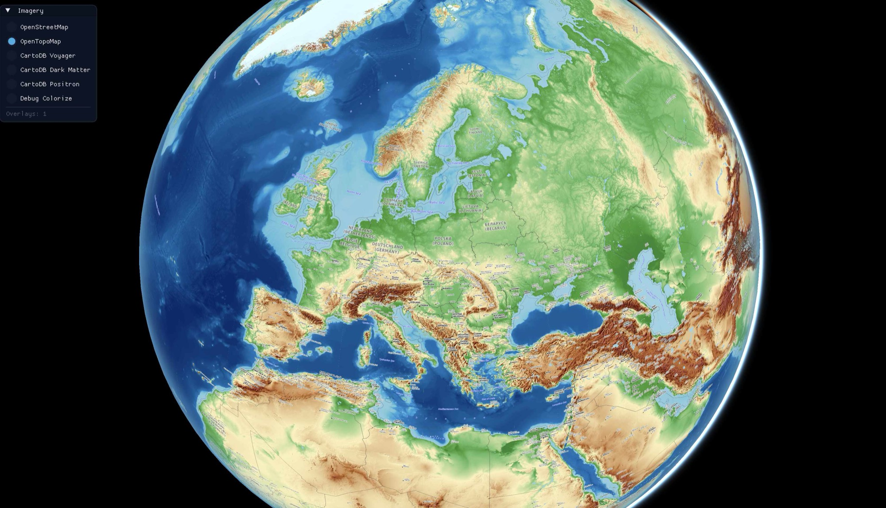
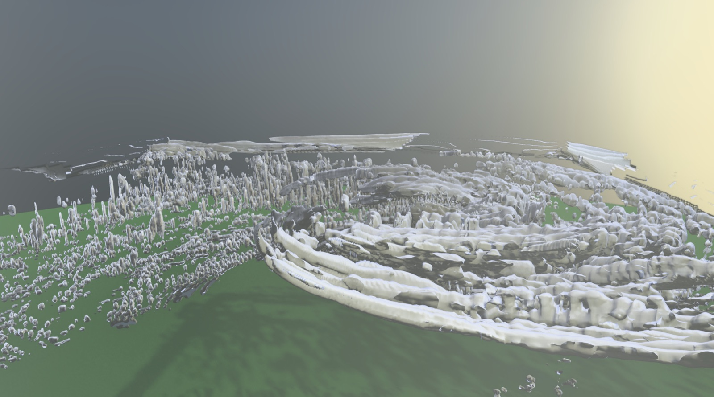
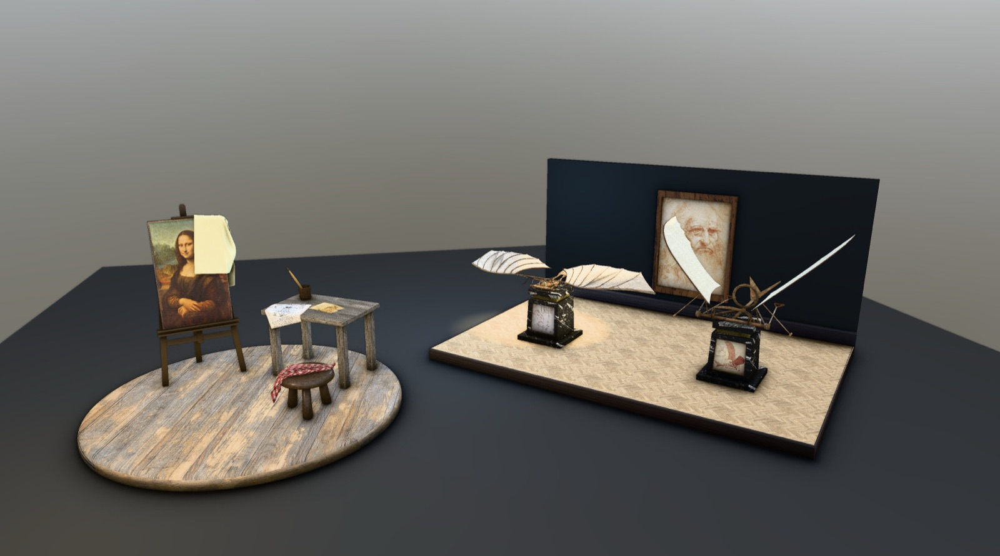

<p align="center">
  
</p>

# VisuTwin Canvas

[](LICENSE)
[](https://en.cppreference.com/w/cpp/23)
[](FEATURES.md)
[](https://canvas.visutwin.com)

A C++23 real-time rendering engine for **digital twins, geospatial scenes, and
scientific visualization** — running natively on Apple Metal and Vulkan 1.3,
built for applications that need a physically based renderer they can embed.

Originally derived from the [PlayCanvas](https://playcanvas.com/) engine's
architecture, rebuilt in C++23 and substantially extended — with a Vulkan
backend, volumetric fog, a ray-traced lightmap baker, instanced wide lines, a
pluggable physics seam with a Jolt backend, and geospatial and
scientific-visualization layers that have no upstream equivalent.

> **Status: Alpha.** The engine renders the scenes shown here and ships 68
> working examples, most of them ports of upstream's own examples, but the API is
> not stable and changes without notice. [FEATURES.md](FEATURES.md) lists what is
> implemented, module by module, along with the known gaps.

## Why this exists

Most engines that render a planet do it in a browser, and most engines that
render a scientific volume are not real-time. VisuTwin Canvas is aimed at the
overlap:

- **Native and embeddable** — a C++ library you link into an application, not a
  runtime you ship a project into or a browser you render inside.
- **Physically based, without a game engine attached** — modern PBR, shadows,
  and post-processing without an editor or a scripting VM. Scripts are C++
  classes, and assets load from glTF/GLB, OBJ, STL, PLY and KTX2 files directly.
- **Built for instrumented scenes** — screen- and world-space UI, 3D-anchored
  labels, an ImGui/ImPlot overlay and immediate-mode debug rendering are
  first-class, because digital twins are mostly data drawn on top of geometry.
- **Two backends, one feature contract** — Metal and Vulkan compile the same 60
  shader features from one declaration, and nine golden-image scenes are
  checked against reference images on each. A few paths are still Metal-only; FEATURES.md
  lists them.
- **Readable by design** — an established engine architecture ported
  deliberately, with deviations from upstream documented in the code.

## What's inside

- **Rendering:** forward PBR on a frame graph; StandardMaterial with clearcoat,
  sheen, iridescence, anisotropy, transmission and refraction, parallax and
  spec-gloss; image-based lighting, SH light probes and reflection probes;
  screen-space reflections; GPU instancing with GPU culling; dynamic batching;
  MSAA.
- **Lighting and shadows:** clustered lighting with a shadow atlas, LTC area
  lights, cascaded directional shadows (PCF, EVSM and PCSS), spot and omni
  shadows, light cookies, volumetric fog, and two lightmap bakers (GPU UV-space
  and CPU ray-traced).
- **Post-processing:** TAA, SSAO, bloom, multi-pass depth of field, colour
  grading and 3D LUTs, tone mapping, planar reflections, Nishita atmosphere.
- **Animation and simulation:** GPU skinning, morph targets, an animation state
  graph with blend trees and per-node layer blending, Gaussian splatting with
  spherical harmonics, GPU particles, and rigid bodies with joints through Jolt.
- **UI and input:** anchored elements, MSDF text with markup, buttons, masks,
  layout groups, scroll views and localization; keyboard, mouse, touch and
  gamepad devices fed from the application's event loop.

[FEATURES.md](FEATURES.md) has the full inventory and the known gaps.

## Gallery

| | |
|---|---|
|  | **Volumetric scientific visualization.** Marching-cubes isosurfaces of the Hurricane Isabel dataset (IEEE Visualization 2004 contest data). Built with [`visutwin-viz`](https://github.com/visutwin). |
|  | **Physically based rendering.** Image-based lighting, soft shadows, and screen-space ambient occlusion — the `ambient-occlusion-davinci` example. |

The globe above is rendered with [`visutwin-geo`](https://github.com/visutwin)
(WGS84 ellipsoid, 3D Tiles, terrain tiling, atmosphere) on top of this engine.
Imagery © [OpenStreetMap](https://www.openstreetmap.org/copyright) contributors
and [OpenTopoMap](https://opentopomap.org/) (CC-BY-SA).

## Getting started

Runs on macOS on Apple Silicon (Metal or Vulkan through MoltenVK) and on Linux
(Vulkan 1.3). Windows is not supported yet. Requires CMake 3.28+, a C++23
compiler (Apple Clang from a current Xcode on macOS, GCC 14 on Linux),
[vcpkg](https://vcpkg.io/), and Ninja. The `vulkan` preset also needs a system
Vulkan loader: the Vulkan SDK on macOS, `libvulkan-dev` on Ubuntu.

```bash
export VCPKG_ROOT=/path/to/vcpkg

cmake --preset default
cmake --build --preset default
ctest --preset default
```

| Preset | Builds |
|---|---|
| `default` | Debug, Metal (`build/`) |
| `release` | Release |
| `examples` | Debug with every example (`build-examples/`) |
| `vulkan` | Debug, Vulkan (`build-vulkan/`) |
| `sanitize` | Debug under AddressSanitizer and UndefinedBehaviorSanitizer (`build-sanitize/`) |

The backends can also be chosen explicitly with `VISUTWIN_BACKEND_METAL=ON|OFF`
and `VISUTWIN_BACKEND_VULKAN=ON|OFF`; at least one must be on.

The Metal backend uses Apple's header-only metal-cpp, carried in
`engine/lib/metal-cpp` and installed to
`<prefix>/include/visutwin/canvas-metal-cpp` for downstream consumers. This is
the authoritative copy for the VisuTwin projects; `visutwin-sim` keeps a
fallback so it builds on its own and is normally pointed here instead:

```bash
cmake -S . -B build -DVISUTWIN_SIM_ENABLE_METAL=ON \
  -DVISUTWIN_SIM_METAL_CPP_DIR=../visutwin-canvas/engine/lib/metal-cpp
```

`VISUTWIN_CANVAS_METAL_CPP_DIR` does the same for this project, so the shared
copy can live anywhere. Keep the copies in step when upgrading; nothing checks
that automatically.

### Examples

The 69 examples are opt-in:

```bash
cmake --preset examples
cmake --build build-examples
open build-examples/examples/visutwin-taa.app
```

Any application built on the engine honours `VISUTWIN_BACKEND` (`metal` or
`vulkan`) and `VISUTWIN_SCREENSHOT` (write a PNG of the back buffer, with
`VISUTWIN_SCREENSHOT_FRAME`, `_TIME` or `_COUNT` choosing when and how many),
so an application can be switched or captured without recompiling. The examples
add their own measurement hooks — `VISUTWIN_FIXED_DT` for deterministic
animation, `VISUTWIN_MAX_PIXEL_RATIO`, `VISUTWIN_CPU_STATS` and others — listed
in [AGENTS.md](AGENTS.md).

### Tests

`ctest --preset default` runs the unit tests (also under the `sanitize` and
`vulkan` presets). Two GPU suites need a window and run locally:
`ctest --preset vulkan-smoke` runs the Vulkan backend under the validation
layers, and `ctest --preset golden` compares nine deterministic examples against
reference images. CI builds the Metal preset with every example, runs the unit
tests on macOS (also under the sanitizers) and on Linux with Vulkan, and checks
the SIMD math on each backend.

## Docs

- [FEATURES.md](FEATURES.md) — full feature inventory and per-module status
- [examples/](examples/README.md) — the examples, grouped and described
- [CONTRIBUTING.md](CONTRIBUTING.md) — layout, tests, and shader workflow
- [ARCHITECTURE.md](ARCHITECTURE.md) — how each subsystem works and where it deviates from upstream
- [AGENTS.md](AGENTS.md) — the rules, contracts and known traps for anyone changing the code
- [canvas.visutwin.com](https://canvas.visutwin.com) — project home page

## Related projects

Separate CMake projects built on this engine:

- **visutwin-geo** — WGS84 ellipsoid, 3D Tiles, terrain tiling, globe camera, atmosphere
- **visutwin-viz** — volume loading, marching cubes, streamlines, transfer functions

## Attribution

VisuTwin Canvas derives its architecture, class hierarchy, and core rendering
algorithms from the [PlayCanvas engine](https://github.com/playcanvas/engine),
used under the MIT License. Work built on that foundation — the Vulkan backend,
volumetric fog, the CPU lightmap baker, the physics integration, and the
geospatial and scientific-visualization layers — is original and licensed under
Apache-2.0. Deviations from upstream behaviour are marked with `DEVIATION:`
comments in the source. See [NOTICE](NOTICE) for full attribution.

## License

Licensed under the Apache License, Version 2.0. See [LICENSE](LICENSE).
